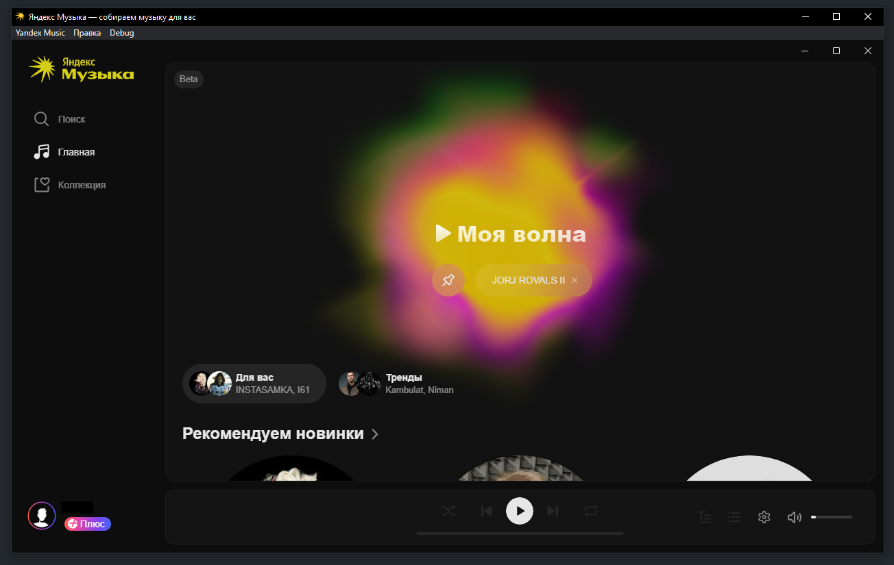

# Yandex Music - мод без Плюса

Мод для Яндекс Музыки позволяющий пользоваться программой без подписки

<<<<<<< HEAD
**Приемущества:**

1. Можно пользоватся без подписки, имея все приемущества
2. Отключены авто-обновления
3. Отключена аналитика
4. Ускорен запуск приложения путем удаления начальной заставки
5. Включен режим разработчика
6. Обновление происходит только путем повторного запуска патчера
7. Программа полностью портативна, но сохраняет сессию в папке AppData

**Как это работает:**

1. Патчер скачивает последний билд Яндекс Музыки через ванильный механизм обновления
2. Вытаскивает портативную версию из билда, при помощи 7zip
3. Распаковывает app.asar, содержащий код electron приложения
4. Вносит патчи в некоторые скрипты приложения
5. Устанавливает расширение, блокирующее аналитику
6. Упаковывает обратно app.asar и создает ярлык на рабочем столе

**Инструкция:**

1. Скачать последнюю версию патчера, либо собрать билд самостоятельно из папки src
2. Запустить YandexMusicPatcher.exe
3. В папке с патчером появится папка Яндекс Музыка с приложением, а на рабочем столе - ярлык для запуска программы
4. Можно пользоваться с ярлыка либо напрямую из папки Яндекс Музыка
=======
>>>>>>> cb009458685a09bd53e20d7064050c3b551c3942
